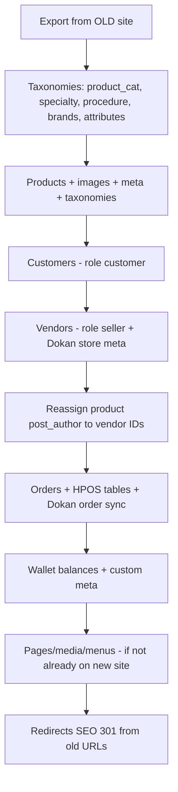

# ConsuCorner — New Site Data Migration Brief

**Purpose:** Share this document with an AI assistant (or migration team) to plan importing data from the **old ConsuCorner website** into this **new local/staging site**.

**Document generated:** 2026-05-21  
**Target site (this environment):** `new-consucorner` on Local by Flywheel  
**Live URL (local):** http://new-consucorner.local  
**Production domain (intended):** https://consucorner.com (per theme metadata)

---

## 1. Business context

ConsuCorner is a **medical e-commerce marketplace** focused on **Egyptian healthcare specialties**. The platform sells surgical instruments, diagnostic equipment, and related medical supplies.

| Aspect | Detail |
|--------|--------|
| Model | Multi-vendor marketplace (Dokan Lite) on WooCommerce |
| Currency | **EGP** (Egyptian Pound) |
| Default country | **EG** (Cairo governorate code in WC: `EG:EGC`) |
| Primary audience | Healthcare professionals, clinics, hospitals in Egypt |
| Catalog size (current) | ~734 products (725 published), all **simple** products |
| Orders (current) | **0** on this site (fresh / not migrated yet) |

---

## 2. Environment & hosting

| Item | Value |
|------|--------|
| Local app | Local WP (Flywheel), site name: **new - consucorner** |
| Site path | `C:\Users\DELL\Local Sites\new-consucorner\app\public` |
| WordPress root | Same as above (`ABSPATH`) |
| PHP | 8.2.27 (Local lightning-services) |
| MySQL | 8.0.35, database name `local`, user `root` |
| MySQL port (Local forwarded) | **10030** (`127.0.0.1:10030` for CLI) |
| Web MySQL host | `localhost` (browser / PHP-FPM) |
| Table prefix | `wp_` |
| Environment type | `local` (`WP_ENVIRONMENT_TYPE`) |
| WP-CLI | `wp-cli.phar` in site root; set `$env:CONSUCORNER_CLI_DB_HOST = '127.0.0.1:10030'` before CLI commands |

**Related Local site (possible old copy):** Another Local site exists named **consucorner** at `~\Local Sites\consucorner` (domain `consucorner.local`, MySQL port **10025**). Confirm with the team whether the **old** data lives there or on production hosting.

---

## 3. Core software versions

| Component | Version |
|-----------|---------|
| WordPress | **6.9.4** |
| WooCommerce | **10.7.0** |
| Dokan Lite | **5.0.2** (marketplace / vendors) |
| Active theme | **ConsuCorner 1.0.2** (custom, Underscores-based) |
| PHP requirement (theme) | 7.4+ |

---

## 4. Active plugins (migration-relevant)

| Plugin | Version | Role |
|--------|---------|------|
| **woocommerce** | 10.7.0 | E-commerce core |
| **dokan-lite** | 5.0.2 | Multi-vendor stores, commissions, vendor dashboard |
| **consucorner-security** | 1.1.1 | Custom security (bot protection, REST hardening, admin logs) |
| **seo-by-rank-math** | 1.0.270 | SEO, sitemaps, primary category meta |
| **paymob-for-woocommerce** | 4.1.2 | Payment gateway (Egypt) |
| **Referral-Discounts-for-WooCommerce-RDFW-main** | 1.4.2 | Referral discounts |
| **forminator** | 1.53.2 | Forms (contact, vendor onboarding, etc.) |
| **updraftplus** | 2.26.4.26 | Backups |

**Inactive but installed:** `geidea-online-payments` 3.5.2

---

## 5. User roles & marketplace model

### WordPress / WooCommerce roles in use

| Role slug | Label | Usage |
|-----------|-------|--------|
| `administrator` | Administrator | Site admins |
| `shop_manager` | Shop manager | WooCommerce shop management |
| `customer` | Customer | Buyers |
| `seller` | **Vendor** | Dokan vendors (this is the vendor role — **not** `vendor`) |
| `editor` / `author` | Editor / Author | Content |

### Dokan vendor rules

- Vendor role in Dokan Lite: **`seller`**
- Vendor store URL pattern: `/store/{user_nicename}/` (Dokan default)
- Products are linked to vendors via **`wp_posts.post_author`** = vendor user ID
- Key vendor user meta (non-exhaustive):
  - `dokan_store_name`
  - `dokan_profile_settings` (serialized store address, phone, banner, etc.)
  - `dokan_enable_selling`, `dokan_publishing`, `dokan_store_time`, etc.

### Current user state (after cleanup on 2026-05-21)

A deliberate **user/vendor reset** was performed. **Before** reset, a full DB backup was taken (see §12).

| Role | Count now |
|------|-----------|
| Administrators | 2 |
| Vendors (`seller`) | **0** |
| Customers | **0** |
| Total users | **2** |

**Remaining accounts:**

| ID | Login | Email | Role |
|----|-------|-------|------|
| 1 | admin | dev-email@wpengine.local | administrator |
| 12 | ahmed.bassiouny | ahmed.basssiouny@abprojects.org | administrator |

**Pre-reset snapshot (from backup / CLI, same day):**

- ~**12 vendors** (`seller`)
- ~**115 customers** (`customer`)
- ~**18 staff** accounts kept (admins, shop_manager, editors, author)
- Vendors were deleted with `--reassign=1` → product `post_author` moved to admin where applicable

**Implication for migration:** You must **re-import vendors and customers** from the old site (or restore from backup and merge). Products still exist but **vendor ownership is broken** for many rows (see §7).

---

## 6. WooCommerce configuration

| Setting | Value |
|---------|--------|
| Currency | EGP |
| HPOS (High-Performance Order Storage) | **Enabled** — orders use `wp_wc_orders` + related tables, not only `wp_posts` |
| Product types in catalog | **100% simple** (no variations in DB) |
| Products with SKU | ~729 of 734 |

### WooCommerce pages (published)

| Page | Slug |
|------|------|
| Shop | `shop` |
| Cart | `cart` |
| Checkout | `checkout` |
| My account | `my-account` |
| Home | `home` |
| About | `about` |
| Contact | `contact` |
| Vendor | `vendor` |
| Store listing | `store-listing` |
| Dashboard | `dashboard` |
| Vendor onboarding | `vendor-onboarding` |
| Shop specialty | `shop-specialty` |
| Shop instruments | `shop-instruments` |
| Help, FAQ, shipping, returns, terms, privacy, etc. | See WP admin → Pages |

---

## 7. Current catalog & data state

### Content counts (live DB, 2026-05-21)

| Entity | Count |
|--------|-------|
| Products (non-trash) | 734 |
| Published products | 725 |
| Product variations | 0 |
| Orders | 0 |
| Published pages | 27 |
| Users | 2 |
| `product_cat` terms | 68 |
| `specialty` terms | 5 |
| `procedure` terms | 63 |
| `product_brand` terms | 2 |
| `product_tag` terms | 0 |

### Product ownership (`post_author`) — **critical for migration**

| Author ID | Login | Product count | Notes |
|-----------|-------|---------------|-------|
| **0** | *(none)* | **586** | Orphaned author — likely from deleted vendors or bad import |
| 1 | admin | 147 | Reassigned after vendor delete |
| 12 | ahmed.bassiouny | 1 | |

**Action required:** After vendors are imported, map each product to the correct vendor (`post_author`) using SKU, old vendor email, or old site export.

### Custom taxonomies (theme-registered)

These are **required** for the new theme and filters. Migrate terms and product assignments from the old site if they exist there (or map to these).

#### `specialty` (hierarchical)

- **Slug:** `specialty`
- **URL rewrite:** `/specialty/{term-slug}/`
- **Registered in:** `wp-content/themes/consucorner/inc/product-specialties-taxonomy.php`
- **Current terms:**

| term_id | Name | Slug | Products |
|---------|------|------|----------|
| 313 | Ophthalmology | ophthalmology | 7 |
| 314 | General specialty | general-specialty | 45 |
| 315 | ENT | ent | 53 |
| 316 | Surgical Instruments | surgical-instruments | 607 |
| 317 | Endoscopy | endoscopy | 12 |

#### `procedure` (hierarchical)

- **Slug:** `procedure`
- **URL rewrite:** `/procedure/{term-slug}/`
- **Registered in:** `wp-content/themes/consucorner/inc/product-procedures-taxonomy.php`
- **63 terms** (procedure types; used for filtering and mega menu)

### Standard WooCommerce taxonomies

| Taxonomy | Count | Notes |
|----------|-------|-------|
| `product_cat` | 68 | Hierarchical categories (main navigation) |
| `product_brand` | 2 | WooCommerce brands feature |
| `product_tag` | 0 | |
| `product_type` | simple only | |

### Global product attributes (WooCommerce `pa_*`)

| Attribute slug | Label |
|----------------|-------|
| `pa_country-of-origin` | Country of Origin |
| `pa_function` | Function |
| `pa_handle-type` | Handle Type |
| `pa_material` | Material |
| `pa_surgical-application` | Surgical Application |
| `pa_tip-dimension` | Tip Dimension |

Attribute images are supported via theme: `inc/attribute-images.php`.

---

## 8. Custom theme features (must preserve in migration)

**Theme path:** `wp-content/themes/consucorner/`

### WooCommerce template overrides

- `woocommerce/archive-product.php`
- `woocommerce/single-product.php`
- `woocommerce/content-single-product.php`
- `woocommerce/cart/cart.php`, `cart-empty.php`
- `woocommerce/checkout/form-checkout.php`, `thankyou.php`
- `woocommerce/myaccount/form-login.php`, `my-account.php`

### Theme PHP modules (`inc/`)

| File | Purpose |
|------|---------|
| `product-specialties-taxonomy.php` | `specialty` taxonomy |
| `product-procedures-taxonomy.php` | `procedure` taxonomy |
| `category-filters.php` | AJAX category filtering on shop |
| `product-mega-menu.php`, `explore-mega-menu.php`, `mega-menu-customizer.php` | Mega menus |
| `mobile-drawer-menu.php` | Mobile navigation |
| `search-experience.php` | Search UX |
| `dokan-overrides.php` | Forces in-stock products purchasable (overrides Dokan catalog mode) |
| `customer-wallet.php` | Customer wallet balance (`_cc_wallet_balance`, `_cc_wallet_transactions`) |
| `admin-wallet-refunds.php` | Admin wallet refund tools |
| `admin-vendor-ledger.php` | Admin vendor financial ledger (uses `wp_dokan_orders`) |
| `profile-account.php` | Custom account/profile UI |
| `assign-specialty-batch-cli.php` | WP-CLI batch assign `specialty` to products |
| `meta-boxes.php`, `customizer.php`, `shop-promo-customizer.php` | Admin/customizer |

### Custom user meta (wallet)

| Meta key | Purpose |
|----------|---------|
| `_cc_wallet_balance` | Customer wallet balance (float) |
| `_cc_wallet_transactions` | Transaction history array |
| `_cc_wallet_refund_wallet_synced` | Legacy sync flag |

---

## 9. Database tables beyond WordPress core

### Dokan custom tables (`wp_dokan_*`)

- `wp_dokan_orders` — order sync / commission data (used by theme vendor ledger)
- `wp_dokan_order_stats`
- `wp_dokan_vendor_balance`
- `wp_dokan_withdraw`
- `wp_dokan_refund`
- `wp_dokan_reverse_withdrawal`
- `wp_dokan_announcement`

### WooCommerce HPOS & lookup tables (`wp_wc_*`)

- `wp_wc_orders`, `wp_wc_orders_meta`
- `wp_wc_order_addresses`, `wp_wc_order_operational_data`
- `wp_wc_order_product_lookup`, `wp_wc_order_stats`, `wp_wc_order_tax_lookup`, `wp_wc_order_coupon_lookup`
- `wp_wc_customer_lookup`
- `wp_wc_product_meta_lookup`, `wp_wc_product_attributes_lookup`
- `wp_wc_category_lookup`
- Plus admin notes, webhooks, rate limits, etc.

**Migration note:** If importing **orders** from the old site, plan for **HPOS-compatible** import (WooCommerce CSV importer, WP All Import with HPOS support, or migration plugin that writes to `wp_wc_orders`).

---

## 10. Payments & integrations

| Gateway | Status |
|---------|--------|
| Paymob | Active plugin |
| Geidea | Installed, inactive |

Confirm which gateway the **old** site used and whether API keys must be re-entered (do not migrate production secrets into this doc).

Other integrations to ask about on the **old** site:

- Rank Math SEO settings & redirects
- Forminator form entries
- Referral plugin user referral codes / balances
- n8n or external automation users (old site had `n8n-admin` editor account)

---

## 11. Recommended migration order (old → new)

Use this sequence to avoid broken references:



### Per-entity notes

| Entity | Old site export needs | New site mapping |
|--------|----------------------|------------------|
| **Categories** | `product_cat` tree, slugs | Match or merge; 68 terms already exist |
| **Specialty** | Custom taxonomy or equivalent field | Map to `specialty` |
| **Procedure** | Custom taxonomy or attributes | Map to `procedure` |
| **Products** | WC export or WP All Import; SKU required | `post_type=product`, simple; attach `specialty`, `procedure`, `product_cat`, `pa_*` |
| **Images** | Media URLs / files | Upload to `wp-content/uploads`; fix `_thumbnail_id` |
| **Vendors** | User email, store name, slug, address | Create user → `wp user set-role {id} seller` + Dokan profile |
| **Customers** | Email, name, billing meta | Role `customer`; unique `user_email` |
| **Orders** | WC order export | HPOS tables + line items; billing/shipping in order meta |
| **Coupons / referrals** | Plugin-specific tables | RDFW plugin + WC coupons |

### Duplicate prevention

WordPress enforces unique **`user_email`** and **`user_login`**.

- Dedupe import CSV by **email** before upload
- Use **Skip if exists** or **Update by email** on re-runs
- Import **customers first**, then **vendors**

---

## 12. Backups on this new site

| File | Description |
|------|-------------|
| `C:\Users\DELL\Local Sites\new-consucorner\backups\database\pre-user-reset_2026-05-21_105226.sql` | Full MySQL dump **before** vendor/customer deletion (~12.3 MB) |
| `...\backups\database\LATEST-BACKUP.txt` | Pointer + restore command |

Restore command (Local MySQL port 10030):

```bash
mysql -h 127.0.0.1 -P 10030 -u root -proot local < "pre-user-reset_2026-05-21_105226.sql"
```

This backup contains the **pre-reset users** (~12 sellers, ~115 customers) if you need to extract emails/logins for migration mapping instead of the old production DB.

---

## 13. WP-CLI cheat sheet (this site)

```powershell
$env:CONSUCORNER_CLI_DB_HOST = '127.0.0.1:10030'
$php = "C:\Users\DELL\AppData\Roaming\Local\lightning-services\php-8.2.27+1\bin\win32\php.exe"
$ext = "C:\Users\DELL\AppData\Roaming\Local\lightning-services\php-8.2.27+1\bin\win32\ext"
$root = "C:\Users\DELL\Local Sites\new-consucorner\app\public"

# List vendors
& $php -d extension_dir=$ext -d extension=mysqli "$root\wp-cli.phar" user list --role=seller --path=$root

# Create vendor from existing user
& $php -d extension_dir=$ext -d extension=mysqli "$root\wp-cli.phar" user set-role <id> seller --path=$root

# Refresh migration stats JSON
& $php -d extension_dir=$ext -d extension=mysqli "$root\wp-cli.phar" eval-file "$root\wp-content\themes\consucorner\inc\migration-stats-cli.php" --path=$root
```

---

## 14. Questions to answer about the OLD website

Provide these to the AI/planner for accurate migration:

1. **Old site URL** and hosting stack (WordPress version, WooCommerce, Dokan Pro vs Lite?)
2. Was the old site also Dokan multi-vendor, or single-store WooCommerce?
3. **Vendor role slug** on old site (`seller`, `vendor`, `wcfm_vendor`, etc.)?
4. Does the old site use **HPOS** for orders?
5. Custom taxonomies on old site — equivalents for `specialty` and `procedure`?
6. Approximate counts: products, vendors, customers, orders, media GB
7. Payment gateway(s) and whether order payment meta must migrate
8. **SKU** — is it the stable key across old/new?
9. Product images: local media library or CDN/hotlinked?
10. Customer **wallet** balances on old site — same `_cc_wallet_*` meta or different system?
11. SEO: Rank Math on old site? URL structure changes needing 301 map?
12. Any data that must **not** be copied (test users, spam orders)?

---

## 15. Known issues on the new site (post-reset)

| Issue | Detail |
|-------|--------|
| No vendors/customers | Intentional reset; import pending |
| 586 products with `post_author = 0` | Must fix when vendors return |
| 147 products on admin | From vendor delete `--reassign=1` |
| 0 orders | Order migration not started |
| 2 admins only | Other staff accounts were removed during cleanup — re-create or import if needed |

---

## 16. File paths quick reference

| Resource | Path |
|----------|------|
| WordPress root | `app/public/` |
| Theme | `wp-content/themes/consucorner/` |
| Custom security plugin | `wp-content/plugins/consucorner-security/` |
| Uploads | `wp-content/uploads/` |
| DB backup | `../backups/database/` (relative to `app/public`: `../../backups/database/`) |
| Specialty CLI guide | `SPECIALTY_ASSIGNMENT_AI_GUIDE.md` |
| This brief | `DATA_MIGRATION_BRIEF.md` |

---

## 17. Summary for AI assistants

**You are migrating into a WordPress 6.9 + WooCommerce 10.7 + Dokan Lite 5 marketplace** with a **custom ConsuCorner theme** that depends on:

- Taxonomies: `product_cat`, **`specialty`**, **`procedure`**, `product_brand`, and six `pa_*` attributes
- Vendor role: **`seller`** and product ownership via **`post_author`**
- HPOS-enabled orders in **`wp_wc_orders`**
- Custom **customer wallet** user meta and **Dokan vendor ledger** admin tools

**Products and taxonomies largely exist already; users and vendor linkage do not.** Priority migrations: (1) vendors, (2) customers, (3) product→vendor reassignment, (4) orders, (5) wallets/SEO/forms as needed.

Use the **pre-user-reset SQL backup** on this machine if you need historical vendor/customer emails without accessing production.
