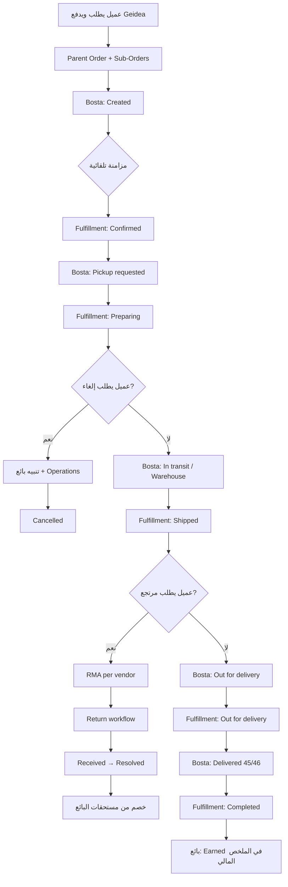

# خطة إدارة حالات الطلبات — ConsuCorner Marketplace

**الإصدار:** 1.0  
**التاريخ:** 15 يوليو 2026  
**الجمهور:** الإدارة، العمليات (Operations)، تطوير المنتج  
**الغرض:** عرض تقديمي يوضح المنطق التجاري، تجربة المستخدم، والخطة التقنية — وليس قائمة أكواد

---

## 1. الملخص التنفيذي

ConsuCorner منصة **WooCommerce + Dokan** (متعدد البائعين) مع شحن **Bosta** ودفع **Geidea**. الهدف من هذه الخطة:

| من يخدمه النظام | ماذا يريد أن يعرف |
|-----------------|-------------------|
| **العميل** | أين طلبي؟ هل أقدر ألغي أو أرجع؟ |
| **البائع (Vendor)** | إيه اللي طلع من مخزني؟ إيه اللي هيرجع؟ كام فلوسي المستحقة والمخصومة؟ |
| **العمليات** | مزامنة Bosta تلقائياً + إمكانية التعديل اليدوي عند الحاجة |
| **الإدارة** | وضوح مالي لكل بائع بدون أتمتة تحويل بنكي (الدفع يبقى يدوي حسب العقد) |

**القرار المعماري الأساسي:** نفصل ثلاث طبقات للحالة — لا نعرض Bosta للعميل، ولا نخلط بين حالة WooCommerce الداخلية وحالة الشحن التفصيلية.

---

## 2. المشكلة التجارية

### 2.1 الوضع الحالي (بدون نظام واضح)

- العميل يرى مصطلحات WooCommerce الافتراضية (`Processing`, `Completed`) — غير مفهومة في سياق الشحن المصري.
- Bosta عنده عشرات الحالات التقنية (`Pickup requested`, `Received at warehouse`, …) — مربكة للعميل وليست مفيدة للبائع بدون سياق مالي.
- الطلب الواحد قد يحتوي منتجات من **أكثر من بائع** → Dokan ينشئ **Sub-Orders** بأرقام مختلفة.
- البائع يستلم فلوسه **تحويل بنكي يدوي** حسب العقد — إذن النظام يوضح **الاستحقاق** ولا يدفع تلقائياً.

### 2.2 الهدف النهائي

> **البائع يفتح الداشبورد ويفهم في 30 ثانية:**  
> منتجات طلعت = فلوس مستحقة | منتجات راجعة = خصم | حالة Bosta التفصيلية = للمتابعة التشغيلية فقط

---

## 3. نموذج الطبقات الثلاث (Status Layers)

هذا هو قلب الخطة. كل طبقة لجمهور مختلف:

```
┌─────────────────────────────────────────────────────────────────┐
│  الطبقة 1 — حالة العميل (Customer Status)                      │
│  بسيطة، عربية/إنجليزية واضحة، في My Account                    │
│  المصدر: Fulfillment المجمّع + قواعد العمل                      │
└────────────────────────────┬────────────────────────────────────┘
                             │ تُشتق تلقائياً
┌────────────────────────────▼────────────────────────────────────┐
│  الطبقة 2 — حالة التنفيذ (Operations Fulfillment)               │
│  لكل بائع على حدة: Ordered → Confirmed → … → Delivered         │
│  المصدر: Bosta (تلقائي) + Operations (يدوي override)           │
└────────────────────────────┬────────────────────────────────────┘
                             │ تُخزَّن خام
┌────────────────────────────▼────────────────────────────────────┐
│  الطبقة 3 — حالة Bosta الخام (Raw Bosta Status)                │
│  للبائع + العمليات فقط — **لا تُعرض للعميل**                   │
│  المصدر: Webhook Bosta → order meta                             │
└─────────────────────────────────────────────────────────────────┘
```

### لماذا ثلاث طبقات؟

| لو خلطناهم | المشكلة |
|------------|---------|
| عرض Bosta للعميل | مصطلحات تقنية + قلق + اتصالات دعم زائدة |
| استخدام WC status فقط | لا يدعم multi-vendor ولا إلغاء/مرتجع على مستوى المنتج |
| حالة واحدة للطلب كله | بائع شحن والتاني لسه بيجهّز — العميل والبائع يتضللوا |

---

## 4. من يرى ماذا؟ (Stakeholder UX)

### 4.1 العميل (My Account / Profile)

**يرى:**
- رقم الطلب الموحّد (الصيغة الحالية: `{دقيقة}{orderID}{ثانية}`)
- **حالة واحدة مبسّطة** (انظر الجدول في القسم 5)
- زر **إلغاء** أو **مرتجع** حسب المرحلة (على مستوى الطلب أو المنتج — انظر القسم 7)
- رابط تتبع Bosta (اختياري — رقم التتبع فقط، بدون مصطلحات Bosta الداخلية)

**لا يرى:**
- `bosta_status` الخام
- `bosta_state_code`
- تفاصيل كل بائع على حدة (إلا لو الطلب multi-vendor ونريد شريط تقدم لكل بائع — مرحلة 2)

### 4.2 البائع (Dokan Vendor Dashboard)

**يرى في قائمة الطلبات وصفحة التفاصيل:**

| العمود / القسم | المحتوى |
|----------------|---------|
| رقم الطلب | Sub-Order الخاص به |
| حالة التنفيذ | Confirmed / Preparing / Shipped / … |
| **حالة Bosta الكاملة** | النص الخام + كود الحالة + رقم التتبع |
| المنتجات | كل منتج: الكمية، السعر، عمولة المنصة، صافي البائع |
| طلبات الإلغاء/المرتجع | تنبيه إذا العميل طلب إلغاء أو مرتجع لمنتجاته |
| **الملخص المالي** | مستحق / مخصوم / صافي (انظر القسم 8) |

**لا يستطيع:**
- تغيير حالة التنفيذ (قراءة فقط — العمليات هي المالكة)
- الموافقة على المرتجع مباشرة (Dokan RMA للعرض + العمليات للقرار)

### 4.3 العمليات (Operations)

**لوحة التحكم الحالية + تحسينات مقترحة:**
- تغيير حالة كل بائع يدوياً (override) مع تسجيل السبب
- رؤية Bosta snapshot + آخر مزامنة
- إنشاء طلبات مرتجع يدوية
- ربط مع صفحة Returns & Refunds و Vendor Ledger

### 4.4 الإدارة

- تقارير من **Vendor Ledger** (موجودة): أداء البائع، عمولة المنصة، صافي الاستحقاق
- لا حاجة لأتمتة التحويل البنكي في هذه المرحلة

---

## 5. ربط Bosta → حالة العميل (الخطة المعتمدة)

### 5.1 جدول المزامنة التلقائية

| حالة Bosta | كود Bosta (إن وُجد) | حالة العميل / Fulfillment | إجراء العميل المسموح |
|------------|---------------------|---------------------------|----------------------|
| Created | 10, 11 | **Confirmed** | طلب إلغاء (طلب أو منتج) → يظهر للبائع |
| Pickup requested | 21, 22 | **Preparing** | طلب إلغاء (طلب أو منتج) → يظهر للبائع |
| In transit / Received at warehouse / Picked up | 20, 30, 31 | **Shipped** | طلب مرتجع (طلب أو منتج) → يظهر للبائع |
| Out for delivery | 41 | **Out for delivery** | طلب مرتجع (طلب أو منتج) → يظهر للبائع |
| Delivered | 45, 46 | **Completed** | التواصل مع الدعم للمرتجع (لا زر تلقائي إلا بسياسة محددة) |
| Terminated / Returned | 48, 100, 101, 104 | **Cancelled** | لا إجراء — الطلب منتهي |

> **ملاحظة PM:** كلمة "Completed" للعميل أفضل من "Delivered" لأنها تتوافق مع WooCommerce وتعني "استلمت طلبك".

> ⚠️ **اختلاف بين الخطة والكود الحالي:** الكود اليوم يصنّف أي حالة Bosta تحتوي "Received at warehouse" على أنها **Preparing** — بينما الخطة المعتمدة تعتبرها **Shipped** (البضاعة خرجت من البائع). يجب تعديل الـ mapping ليتطابق مع الجدول أعلاه. (انظر الفجوة #7 في القسم 9.1)

### 5.2 قواعد المزامنة

1. **تلقائي:** عند تغيير `bosta_status` أو `bosta_state_code` عبر Webhook → تحديث Fulfillment لكل البائعين المعنيين.
2. **اتجاه واحد للأمام:** Bosta لا ترجّع الحالة لوراء (مثلاً من Shipped إلى Confirmed) إلا بـ override يدوي.
3. **Override يدوي:** Operations تقدر تغيّر أي حالة مع تسجيل في Order Notes + من يغيّر.
4. **لا تغيير تلقائي لحالة WooCommerce `wc-status`** في المرحلة الأولى — نعرض للعميل `fulfillment_label` بدل `Processing`. (يقلل مخاطر كسر Geidea/Dokan)

### 5.3 حالة العميل المجمّعة (Multi-Vendor)

عندما الطلب فيه أكثر من بائع:

| قاعدة العرض | مثال |
|-------------|------|
| نعرض **أبطأ بائع** (الأقل تقدماً) كحالة العميل الرئيسية | بائع A: Shipped، بائع B: Preparing → العميل يرى **Preparing** |
| نضيف شريط تفصيلي (مرحلة 2): "2 من 3 بائعين شحنوا طلبك" | يقلل شكاوى "ليه الحالة Preparing والطرد وصل؟" |

**هذه نقطة تحتاج قرار إداري** — انظر القسم 12.

---

## 6. نموذج الطلبات المتعددة (Dokan Sub-Orders)

### 6.1 كيف يعمل Dokan

```
طلب العميل (Parent Order) #45541930
├── Sub-Order للبائع A  #45541931
├── Sub-Order للبائع B  #45541932
└── Sub-Order للبائع C  #45541933
```

- العميل يرى **رقم Parent** في My Account.
- كل بائع يرى **Sub-Order الخاص به** فقط في Dokan.
- الـ Fulfillment meta تُخزَّن على **Parent Order** مع مفتاح لكل `vendor_id`.

### 6.2 Bosta والشحن — نقطة حرجة

**السؤال التجاري:** هل ConsuCorner تشحن طلب multi-vendor في **شحنة Bosta واحدة** أم **شحنة لكل بائع**؟

| السيناريو | الوضع التقني الحالي | المطلوب |
|-----------|---------------------|---------|
| **شحنة واحدة** للطلب كله | ✅ يعمل — Webhook يحدّث كل البائعين بنفس الحالة | مناسب لعملياتكم إذا التجميع من مستودع واحد |
| **شحنة لكل بائع** | ⚠️ **فجوة** — Webhook مربوط بـ order_id واحد ويحدّث كل البائعين معاً | نحتاج ربط كل sub-order / vendor بـ `tracking_number` منفصل |

**توصية PM:** قبل التطوير، العمليات تؤكد نموذج الشحن الفعلي. 90% من الماركت بليس في مصر إما:
- (أ) تجميع من مستودع المنصة → شحنة واحدة، أو
- (ب) كل بائع يشحن لوحده → شحنات متعددة

الخطة تدعم (أ) اليوم، وتحتاج مرحلة إضافية لـ (ب).

---

## 7. الإلغاء والمرتجع حسب المرحلة

### 7.1 مصفوفة الإجراءات

| مرحلة Fulfillment | العميل | البائع يرى | العمليات |
|-------------------|--------|------------|----------|
| Ordered / Confirmed / Preparing | **إلغاء** (كامل أو منتج) | تنبيه "طلب إلغاء" | موافقة/رفض → Cancelled |
| Shipped / Out for delivery | **مرتجع** (كامل أو منتج) | تنبيه "طلب مرتجع" | RMA workflow |
| Completed | **تواصل مع الدعم** للمرتجع/الاسترداد — لا زر ذاتي | تنبيه "طلب مرتجع" عند إنشائه من العمليات | العمليات تنشئ RMA يدوياً بعد التواصل |
| Cancelled | لا شيء | إشعار بالإلغاء | — |

> ⚠️ **اختلاف بين الخطة والكود الحالي:** الكود اليوم يسمح للعميل بفتح طلب مرتجع ذاتي حتى بعد **Delivered** (الحالات المؤهلة تشمل `delivered`). الخطة المعتمدة تقول: بعد التسليم العميل **يتواصل مع الدعم** والعمليات تنشئ الطلب يدوياً — ويظهر عند البائع بنفس الشكل. يجب إزالة `delivered` من الحالات المؤهلة للمرتجع الذاتي (أو ربطها بنافذة زمنية حسب قرار الإدارة — سؤال #3 في القسم 12).

### 7.2 على مستوى المنتج (Line Item)

الخطة تدعم:
- إلغاء **منتج واحد** من الطلب (قبل الشحن)
- مرتجع **منتج واحد** (بعد الشحن)
- كل طلب يُنشئ **RMA منفصل per vendor** (موجود في الكود: `create_manual_return_requests`)

**الوضع الحالي مقابل الخطة:**

| القدرة | مرتجع | إلغاء |
|--------|--------|--------|
| على مستوى المنتج الواحد | ✅ موجود (RMA) | ❌ **غير موجود** — الإلغاء الحالي على الطلب كله فقط |
| ربط الزر بمرحلة Fulfillment | ✅ موجود (بعد Shipped+) | ❌ مربوط بحالة WooCommerce (`pending/on-hold/processing`) وليس بمراحل Confirmed/Preparing |

أي أن **طلب إلغاء منتج واحد** — وهو مطلب أساسي في الخطة — يحتاج بناء جديد في المرحلة 1 (نموذج طلب إلغاء + انعكاسه في داشبورد البائع).

### 7.3 ما لا يحدث تلقائياً (بقصد)

| الإجراء | السبب |
|---------|--------|
| استرداد Geidea تلقائي | بوابة الدفع تحتاج عمليات يدوية / Wallet |
| تحويل بنكي للبائع تلقائي | العقد يدوي |
| إلغاء Bosta تلقائي عند إلغاء العميل | يحتاج تكامل API إضافي — مرحلة لاحقة |

---

## 8. النموذج المالي للبائع (بدون أتمتة دفع)

الهدف: **وضوح الاستحقاق** وليس الدفع الآلي.

### 8.1 حالات المنتج المالية

```
┌──────────────┐     شحن ناجح      ┌──────────────┐
│   Pending    │ ───────────────►  │   Earned     │  ← يُضاف لصافي البائع
│  (قبل الشحن) │                   │  (مستحق)     │
└──────────────┘                   └──────┬───────┘
       │                                  │
       │ إلغاء قبل الشحن                   │ مرتجع مُستلم
       ▼                                  ▼
┌──────────────┐                   ┌──────────────┐
│  Cancelled   │                   │  Deducted    │  ← يُخصم من صافي البائع
│  (لا استحقاق)│                   │  (مخصوم)     │
└──────────────┘                   └──────────────┘
```

### 8.2 ما يظهر في داشبورد البائع (مقترح)

**بطاقة ملخص لكل طلب:**

| البند | القيمة |
|-------|--------|
| إجمالي منتجاتي في الطلب | 1,500 ج.م |
| عمولة المنصة | -150 ج.م |
| صافي قبل المرتجعات | 1,350 ج.م |
| منتجات مرتجعة (مؤكدة) | -450 ج.م |
| **صافي مستحق** | **900 ج.م** |

**حالات العرض:**
- `Earned` = Fulfillment وصلت Shipped+ ولم يُلغَ المنتج
- `Deducted` = Return workflow وصلت `Received` + `Resolved`
- `Pending` = قبل Shipped

### 8.3 الربط مع Vendor Ledger (موجود)

صفحة **WooCommerce → Vendor Ledger** تعرض بالفعل:
- عمولة الإدارة
- أرباح البائع
- فلترة بالتاريخ والبائع

**المرحلة القادمة:** إضافة أعمدة `Shipped Value` / `Return Deductions` / `Net Payable` في نفس التقرير.

---

## 9. ما هو مُنفَّذ اليوم في الموقع

> هذا القسم مهم للإدارة — جزء كبير من الخطة **موجود فعلاً** ولا نبدأ من صفر.

| المكوّن | الحالة | الملف / المكان |
|---------|--------|----------------|
| حالات Fulfillment (7 حالات) | ✅ منفّذ | `order-return-workflow.php` |
| تخزين حالة لكل بائع | ✅ منفّذ | meta: `_cc_ops_fulfillment` |
| مزامنة Bosta → Fulfillment | ✅ منفّذ | `maybe_sync_fulfillment_from_bosta()` |
| جدول أكواد Bosta | ✅ منفّذ | `map_bosta_to_fulfillment()` |
| Override يدوي للعمليات | ✅ منفّذ | Operations panel |
| عرض للبائع (قراءة فقط) | ✅ منفّذ | Dokan order list + detail |
| بوابة المرتجع للعميل | ✅ منفّذ | بعد Shipped+ |
| RMA متعدد البائعين | ✅ منفّذ | `create_manual_return_requests()` |
| Vendor Ledger مالي | ✅ منفّذ | `admin-vendor-ledger.php` |
| دليل العمليات | ✅ منفّذ | `operations-fulfillment-guide.html` |

### 9.1 فجوات يجب إغلاقها

| # | الفجوة | التأثير على البيزنس | الأولوية |
|---|--------|---------------------|----------|
| 1 | العميل **ما زال يرى** `bosta_status` في Profile | ارتباك + مصطلحات تقنية | 🔴 عالية |
| 2 | العميل يرى WC status (`Processing`) بدل الحالة المبسّطة | تجربة غير واضحة | 🔴 عالية |
| 3 | لا يوجد **ملخص مالي** في داشبورد البائع per order | البائع لا يفهم فلوسه | 🔴 عالية |
| 4 | Bosta واحد يحدّث **كل البائعين** بنفس الحالة | خطأ لو شحنات متعددة | 🟡 متوسطة (حسب نموذج الشحن) |
| 5 | إشعار البائع بطلب إلغاء العميل | البائع قد لا يعرف | 🟡 متوسطة |
| 6 | شريط تقدم multi-vendor للعميل | شكاوى دعم | 🟢 منخفضة (مرحلة 2) |
| 7 | "Received at warehouse" يُترجم في الكود إلى **Preparing** بدل **Shipped** | العميل يفتكر البضاعة لسه عند البائع وهي فعلاً في الطريق + يتأخر فتح باب المرتجع | 🔴 عالية |
| 8 | المرتجع الذاتي متاح بعد **Delivered** بينما الخطة تقول "تواصل مع الدعم" بعد التسليم | سياسة مرتجعات غير متحكم فيها بعد الاستلام | 🔴 عالية |
| 9 | لا يوجد **إلغاء على مستوى المنتج** — الإلغاء الحالي للطلب كله ومربوط بحالة WooCommerce وليس Fulfillment | العميل لا يقدر يلغي منتج واحد قبل الشحن كما تنص الخطة | 🔴 عالية |

---

## 10. خارطة الطريق (Roadmap)

### المرحلة 1 — تصحيح تجربة العميل (1–2 أسبوع)

**الهدف:** العميل يرى حالة واضحة فقط.

- [ ] إخفاء `bosta_status` من واجهة العميل
- [ ] عرض `fulfillment_label` كحالة رئيسية بدل WC status
- [ ] تصحيح mapping: "Received at warehouse" → **Shipped** (بدل Preparing)
- [ ] ربط زر الإلغاء بمراحل Fulfillment (Confirmed/Preparing) بدل حالة WooCommerce
- [ ] بناء **طلب إلغاء على مستوى المنتج** + انعكاسه في داشبورد البائع
- [ ] إغلاق المرتجع الذاتي بعد **Completed** (يتحول إلى "تواصل مع الدعم")
- [ ] إشعارات بريدية عند تغيّر الحالة (اختياري)

**مؤشر نجاح:** انخفاض تذاكر الدعم "طلبي فين؟" بنسبة قابلة للقياس.

### المرحلة 2 — وضوح مالي للبائع (2–3 أسابيع)

**الهدف:** البائع يفهم الاستحقاق والخصم.

- [ ] بطاقة مالية في صفحة تفاصيل الطلب (Dokan)
- [ ] عمود "صافي مستحق" في قائمة طلبات البائع
- [ ] ربط حالة المرتجع (`Received` / `Resolved`) بالخصم التلقائي في العرض
- [ ] توسيع Vendor Ledger بأعمدة Shipped / Returned / Net

**مؤشر نجاح:** البائع يسأل أقل "فلوسي فين؟" والعمليات تقضي وقت أقل في الرد.

### المرحلة 3 — شحنات متعددة per vendor (حسب قرار العمليات)

**الشرط:** تأكيد أن كل بائع له شحنة Bosta منفصلة.

- [ ] ربط `bosta_tracking_number` بـ `vendor_id` / sub-order
- [ ] Webhook يحدّث البائع المعني فقط
- [ ] شريط تقدم multi-vendor للعميل

### المرحلة 4 — تحسينات تشغيلية (لاحقاً)

- [ ] إلغاء شحنة Bosta عبر API عند موافقة العمليات على الإلغاء
- [ ] تقرير أسبوعي للإدارة: طلبات عالقة، مرتجعات، استحقاقات
- [ ] تنبيهات Telegram/Email للعمليات عند حالات Bosta حرجة (Terminated, Returned)

---

## 11. تدفق العمل الكامل (Lifecycle)



---

## 12. قرارات محسومة وقرارات مطلوبة

### 12.1 قرارات محسومة بالفعل (جزء من الخطة — للتأكيد فقط)

| القرار | الحسم |
|--------|-------|
| مرتجع بعد Completed | **تواصل مع الدعم** — لا زر ذاتي بعد التسليم، والعمليات تنشئ الطلب ويظهر للبائع |
| عرض Bosta للبائع | **كل الحالات** تُعرض في داشبورد البائع |
| المزامنة | تلقائية من Bosta + **override يدوي** للعمليات |
| دفع البائع | **يدوي** (عقد + تحويل بنكي) — النظام يعرض الاستحقاق فقط |

### 12.2 قرارات مطلوبة من الإدارة قبل المرحلة 2

| # | السؤال | الخيارات | توصية PM |
|---|--------|----------|----------|
| 1 | نموذج الشحن لـ multi-vendor | (أ) شحنة واحدة (ب) شحنة لكل بائع | اسألوا العمليات — يحدد المرحلة 3 |
| 2 | حالة العميل في multi-vendor | (أ) أبطأ بائع (ب) شريط تفصيلي (ج) الاثنين | **(ج)** للشفافية |
| 3 | نافذة قبول المرتجع عبر الدعم بعد التسليم | (أ) مفتوحة (ب) 7 أيام (ج) 14 يوم | **(ب)** 7 أيام — شائع في E-commerce مصر |
| 4 | من يوافق على الإلغاء قبل الشحن؟ | (أ) Operations فقط (ب) البائع + Operations | **(أ)** — البائع يُبلَّغ فقط |

---

## 13. المخاطر والتخفيف

| المخاطرة | الاحتمال | التخفيف |
|----------|----------|---------|
| Webhook Bosta يتأخر | متوسط | Operations override + polling دوري (cron) |
| عميل يلغي بعد الشحن | منخفض | منع الإلغاء بعد Shipped — مرتجع فقط |
| بائع يشتكي من خصم غير عادل | متوسط | سجل تاريخي + ربط الخصم بـ Return `Received` فقط |
| تعارض مع Geidea | منخفض | لا نغيّر WC payment status تلقائياً |
| تعارض مع Dokan commission | منخفض | نستخدم `dokan_orders` table الموجود |

---

## 14. ملخص للعرض على المدير (Slide-ready)

### الشريحة 1 — المشكلة
ثلاث جهات (عميل، بائع، عمليات) تحتاج ثلاث رؤى مختلفة لنفس الطلب.

### الشريحة 2 — الحل
ثلاث طبقات حالة: عميل مبسّط | تنفيذ per vendor | Bosta خام للبائع.

### الشريحة 3 — القيمة التجارية
- عميل أقل قلقاً واتصالات أقل
- بائع يفهم فلوسه بدون مكالمات
- عمليات: 80% تلقائي من Bosta + 20% override

### الشريحة 4 — الوضع الحالي
~70% من البنية التقنية **موجودة**. المتبقي: UX العميل + الملخص المالي للبائع.

### الشريحة 5 — الاستثمار
- مرحلة 1: 1–2 أسبوع (عميل)
- مرحلة 2: 2–3 أسابيع (بائع مالي)
- مرحلة 3: حسب قرار نموذج الشحن

### الشريحة 6 — ما لن نفعله (بقصد)
- لا تحويل بنكي آلي
- لا استرداد Geidea آلي
- لا عرض Bosta للعميل

---

## 15. مسرد المصطلحات

| المصطلح | المعنى في ConsuCorner |
|---------|---------------------|
| Parent Order | طلب العميل الرئيسي في WooCommerce |
| Sub-Order | طلب Dokan لبائع واحد |
| Fulfillment Status | حالة التنفيذ الداخلية (7 حالات) |
| Bosta Raw Status | الحالة التقنية من شركة الشحن |
| Customer Status | ما يراه العميل (مشتق من Fulfillment) |
| RMA | طلب مرتجع عبر Dokan RMA |
| Vendor Ledger | تقرير مالي الإدارة للبائعين |
| Earned / Deducted | مستحق / مخصوم في ملخص البائع |

---

## 16. المراجع الداخلية

- دليل العمليات: `wp-content/themes/consucorner/docs/operations-fulfillment-guide.html`
- كود Workflow: `wp-content/themes/consucorner/inc/order-return-workflow.php`
- Vendor Ledger: `wp-content/themes/consucorner/inc/admin-vendor-ledger.php`
- واجهة العميل: `wp-content/themes/consucorner/inc/profile-account.php`

---

*تم إعداد هذه الخطة بناءً على الوضع الفعلي للكود في الموقع — وليس نظرياً فقط.*
